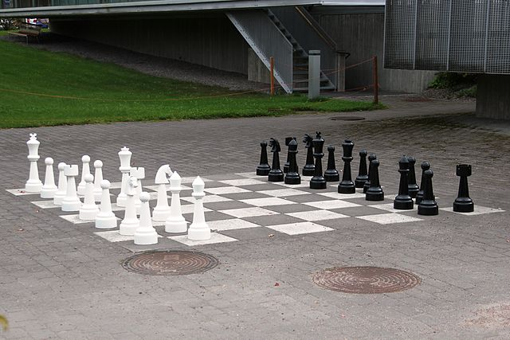

# Chessbots

## What is this about?

You probably have seen something like this:

My idea is, to make the pieces movable. You play a game on your mobile phone or any other device that has a webbrowser, and the real pieces on the street will also make every move you and your opponent will make.

So, we are talking about 32 individual robots, each one is a chesspiece and you can play with them.

## Current state of the project

This is a very early project state. I'm prototyping the general concepts of how to move, how to keep track of movements, how to power each robot long enough for at least one game, and so on.

You may contact me (have a look at my github profile, or leave an issue), if you are interested in this project or want to contribute. There are plenty of issues, that are not solved yet. (languages I understand: german and english)

## Getting started

### Parts

For the prototype you need some things:

Hardware:

- ESP6288 NodeMCU Module
- RFID-RC522 Module
- Robot chassis for a three wheeled robot (two wheels controlled by dc motors, one free turning wheel)
- L293D motor driver
- 6 AA accus within a battery holder
- some cables
- breadboard or stripboard (depending on how permament you wan't to build this ;))

Software: 
- [Fritzing](http://fritzing.org/) To read the wiring schemas

