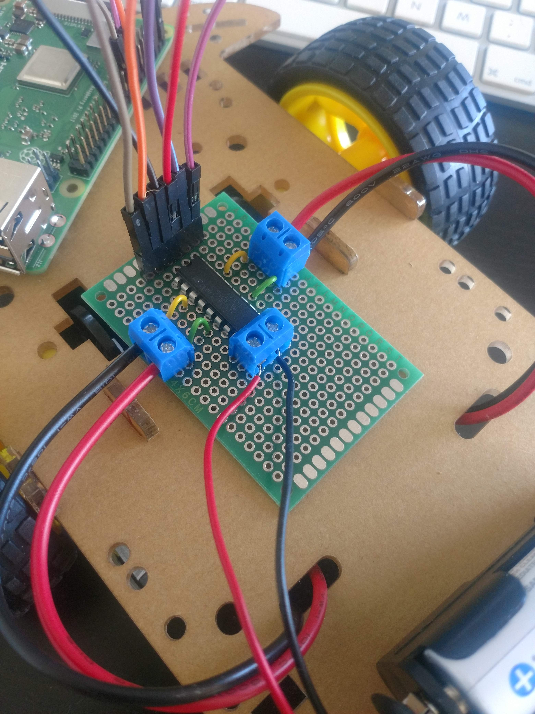
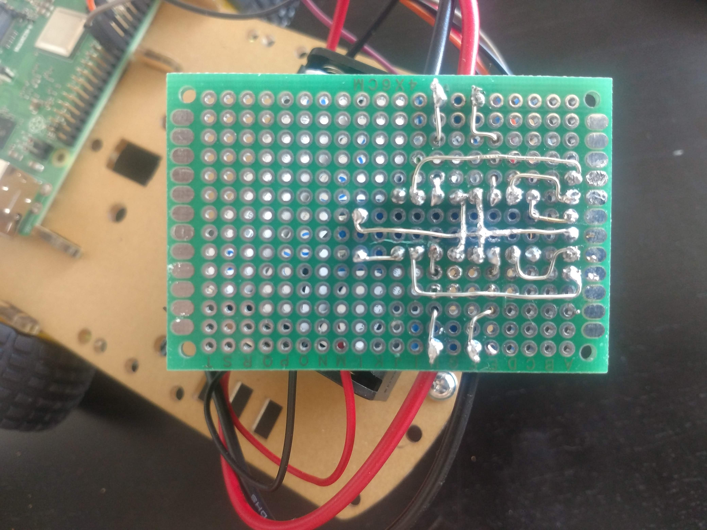

# The prototype

## Test 1: Controlling Wheels 2018-06-26

### Target: Have a movable robot.

Wiring & Parts: Mostly the same as here: https://tutorials-raspberrypi.de/raspberry-pi-roboter-bausatz-zusammenbau/
Currently the rpbi is powered via an external usb cable, not by the batteries.

### Code:

See /javascript/ 

---

## Test 2: Soldered board for motor controls and some nfc testing 2018-08-05

Soldered the motor controls. Is a lot more work than expected. Layout takes something about 2-3 hours. Soldering itself 3-4 hours. Also two hands are not enough for this job.
Lucky me did not care about rotation of L293D until it was soldered. But I placed it correctly. (50-50 change).

Adding NFC module is trivial. Reading also is, if you skip authentication. But writing fails.
Have to figure out if it is authentication or just a not so good library.
But, in case of emergeny, there is no need for writing for the bots.

Currently I'm writing the NFC tags with the smartphone, but I did not find an app, that can write hexacodes, only predefined formats. The idea is to use one pair of hexacode for the coordinates of the field. So, next research issue is NFC and stuff.

Lessons learned:
- I need a third hand
- Have a back view of the layout while soldering the back.
- sweating like soldering can be frightening (drop of sweat drops. First thought: OH NO, SOLDERING WIRE IS DROPPING ON MY KNEE, IT GONNA HURT)

Stripboard layout:

Front:

Back:

